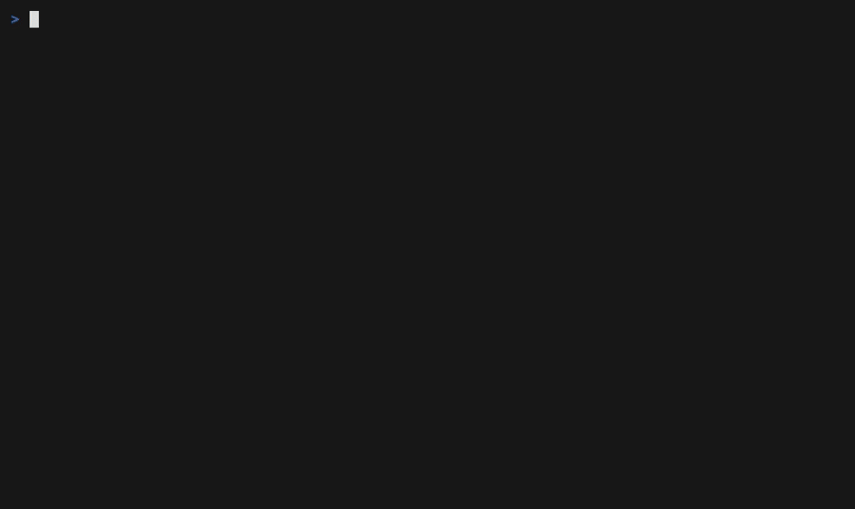

# dockup

**Interactive TUI to install, harden and maintain container runtimes** — Docker Engine + Compose v2 on Linux, NVIDIA Container Toolkit for GPU workloads, and Apple's native `container` tool on macOS (Apple Silicon).

[](https://github.com/paulo-amaral/dockup/actions/workflows/ci.yml)
[](https://github.com/paulo-amaral/dockup/releases/latest)
[](LICENSE)
[](go.mod)



One command. A menu shows what your host has, what is missing and what can be hardened:

```text
⚡ dockup v2.0.0 — install & maintain container runtimes

╭──────────────────────────────────────────────────────╮
│ host    Ubuntu 24.04.2 LTS (amd64)                   │
│ docker  28.3.1   compose 2.38.1                      │
│ root yes   nvidia gpu yes   nvidia-ctk no            │
╰──────────────────────────────────────────────────────╯
❯ Install / update Docker Engine + Compose v2
      Official get.docker.com script: engine, CLI, buildx and compose plugins
  Install NVIDIA Container Toolkit
  Apply security hardening
  Security audit (read-only)
  Status & disk usage
  Prune unused data

  ↑/↓ move • enter run • r refresh • q quit
```

## Quick start

```sh
curl -fsSL https://raw.githubusercontent.com/paulo-amaral/dockup/master/install.sh | sh
```

The bootstrap downloads the latest release binary for your OS/arch, **verifies its SHA-256 checksum** against the release manifest and launches the TUI. Or grab a binary from [Releases](https://github.com/paulo-amaral/dockup/releases) and run `dockup`.

For servers and CI, skip the TUI:

```sh
sudo dockup --yes install   # Docker Engine + Compose v2
sudo dockup --yes nvidia    # NVIDIA Container Toolkit
sudo dockup --yes podman    # Podman from the distro repos
sudo dockup --yes harden    # apply security defaults
dockup --yes audit          # read-only security report

# machine-readable audit for CI gates: exit code 3 when any check WARNs
dockup --yes audit --format json
```

## What it does

| Action | Details |
| --- | --- |
| `install` | Docker Engine, CLI, buildx and **Compose v2 plugin** via the official `get.docker.com` script (the deprecated python `docker-compose` v1 is never installed) |
| `nvidia` | [NVIDIA Container Toolkit](https://docs.nvidia.com/datacenter/cloud-native/container-toolkit/latest/install-guide.html), the supported successor of the retired `nvidia-docker2` |
| `harden` | Log rotation (`max-size`/`max-file`), `live-restore`, `no-new-privileges` in `/etc/docker/daemon.json` — merged, never clobbered, with a timestamped backup |
| `podman` | [Podman](https://podman.io) from the distro's own repositories, daemonless and rootless-friendly |
| `audit` | Read-only checks inspired by the CIS Docker Benchmark: socket permissions, `docker` group members, daemon flags, privileged containers. `--format json` + exit code 3 on WARN for CI gates |
| `status` / `prune` | Engine health, `docker system df`, cleanup of unused data (with confirmation) |
| `apple-install` / `apple-start` / `apple-status` | [Apple's open source `container`](https://github.com/apple/container) on macOS Apple Silicon |

On macOS, `apple-install` prefers [MacPorts](https://ports.macports.org/port/container/) and falls back to Apple's signed `.pkg` from the official releases. Homebrew users can install it themselves with `brew install --cask container`; dockup detects it either way.

## Supported platforms

- **Linux** (Debian, Ubuntu, RHEL, Fedora, CentOS Stream, Rocky, Alma, Amazon Linux) on amd64 and arm64
- **macOS on Apple Silicon** for Apple's `container` runtime (macOS 15.5+); Intel Macs should use Docker Desktop

## Security

- `install.sh` verifies SHA-256 checksums before executing anything
- Privileged steps are labeled `[sudo]` in the UI and refuse to run without root
- Hardening backs up `daemon.json` and aborts rather than overwrite a file it cannot parse
- No telemetry
- See [SECURITY.md](SECURITY.md) for the vulnerability disclosure policy

## Build from source

```sh
go install github.com/paulo-amaral/dockup/cmd/dockup@latest
```

Or clone and build:

```sh
git clone https://github.com/paulo-amaral/dockup.git
cd dockup
go build -o dockup ./cmd/dockup
```

## Contributing

Issues and PRs are welcome. Run `go test ./...` and `shellcheck install.sh` before submitting. The security defaults live in one place, [internal/steps/harden.go](internal/steps/harden.go) (`hardenSettings`), if you want to propose different values.

## License

[MIT](LICENSE) © 2019-2026 Paulo Sérgio Amaral

---

*Keywords: docker installer, docker compose v2 install, docker tui, terminal ui, podman installer, nvidia container toolkit installer, gpu docker, docker security hardening, CIS docker benchmark, apple container macos, macports, homelab, devops tools, bubbletea*
